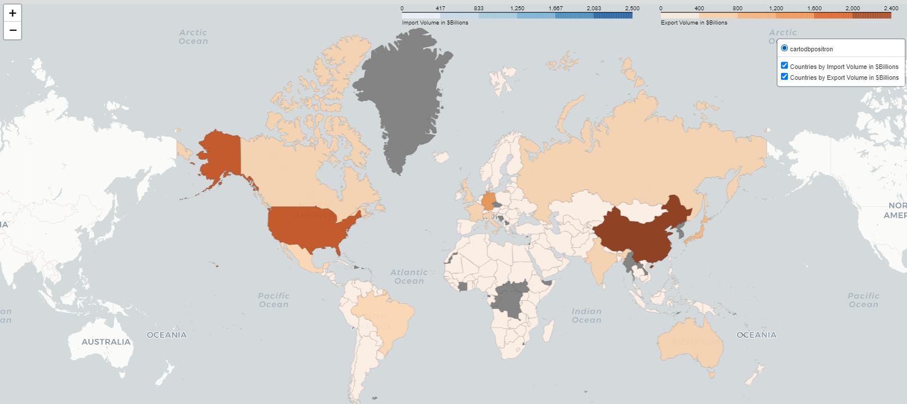

# Global Trade Visualizer

## Overview

The **Global Trade Visualizer** is a Jupyter notebook script that visualizes global import and export data for countries using interactive choropleth maps. The project aggregates data and displays it on a map, providing insights into international trade patterns and economic trends. This tool helps to better understand the global flow of goods and services, offering a clear, visual representation of trade volumes across various regions.

---

## Features

- Visualizes import and export data for countries worldwide.
- Interactive choropleth maps that provide a visual representation of trade data.
- Displays the import/export values for each country.
- Easy-to-understand color coding for data based on trade volumes.
- Uses GeoJSON for country borders and pandas for data manipulation.

---

## Requirements

1. Python 3.x
2. Jupyter Notebook or JupyterLab
3. `folium` library for map creation
4. `pandas` library for data manipulation
5. `requests` library for fetching external GeoJSON data

---

## Setup

### 1. Clone the repository:
```bash
git clone https://github.com/yourusername/global-trade-visualizer.git
cd global-trade-visualizer
```

### 2. Install required packages:

Ensure you have the necessary Python libraries:

```
pip install folium pandas requests
```

### 3. Prepare the data:

The script fetches the necessary data from external sources such as OpenWeather API and GeoJSON files. Make sure you have access to a file containing global import/export data in the CSV format (import_export_data.csv), and update the path in the script accordingly.

### 4. Run the script:

Once you've set up the environment and data, open and run the global_trade_visualizer.ipynb Jupyter notebook.

```
jupyter notebook global_trade_visualizer.ipynb
```

---

## Usage

   - The Jupyter notebook will display interactive choropleth maps of countries, showing the import and export volumes.
   - Data can be updated or modified by changing the input data (import_export_data.csv).
   - You can adjust the color scales and the map's visual properties by tweaking the parameters in the notebook.

---

## Example Output

This is an example of the map generated by the script, showing import and export data for countries using different color scales.



The data for import/export volumes is sourced from a CSV file that includes the following columns:

   - Country/region: The name of the country or region.
   - Imports: The import volume in billions of dollars.
   - Exports: The export volume in billions of dollars.

You can find the example data used in this project in the import_export_data.csv file.

